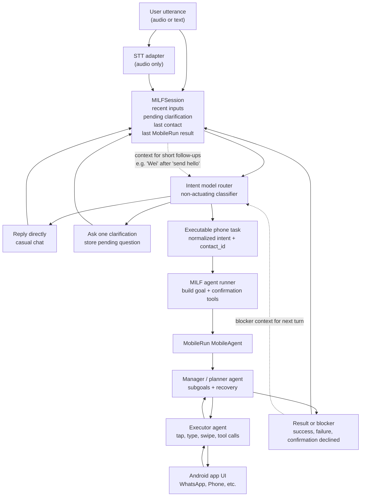

# MILF Intent Orchestration Architecture

## Pattern

MILF owns the conversational/session layer. Every user input goes through the intent model first, with `MILFSession` summarized into the prompt. That router decides whether to reply, clarify, refuse, or hand off an executable phone task.

MobileRun only receives concrete phone goals. Its manager/planner and executor are used for UI reasoning and device actions, while MILF records the outcome back into session state for the next turn.

This keeps casual speech and ambiguity out of MobileRun's action loop, while still letting MobileRun do the hard phone automation once the task is clear.
